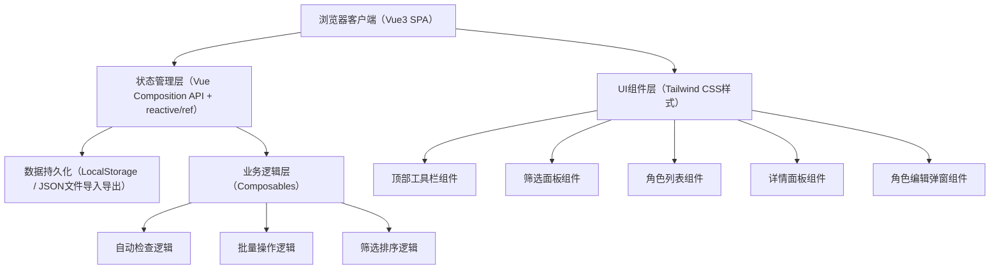
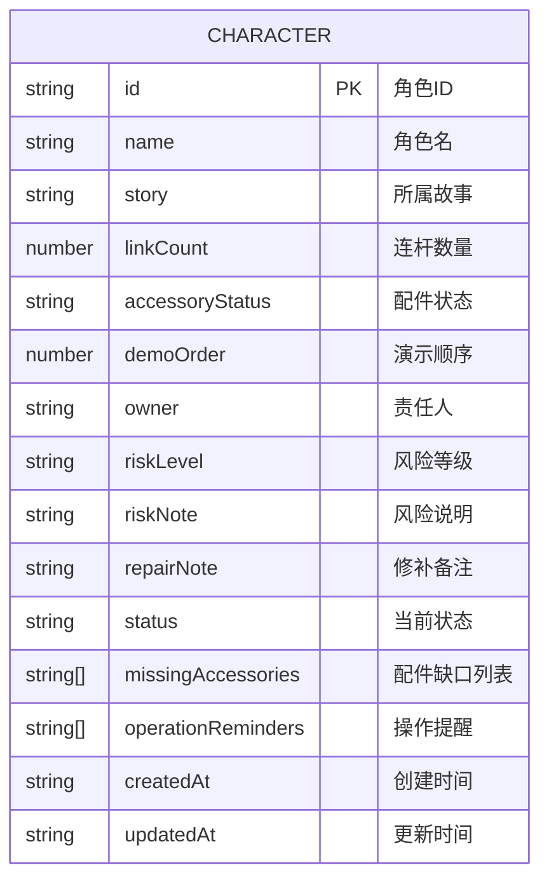

## 1. 架构设计



## 2. 技术描述

- **前端框架**：Vue 3 + TypeScript + Vite
- **样式方案**：Tailwind CSS 3
- **路由**：单页应用，无需 vue-router（单页面管理）
- **状态管理**：Vue 3 Composition API（reactive/ref），配合 Pinia（如复杂度需要）
- **图标库**：Lucide Vue
- **数据存储**：浏览器 LocalStorage + JSON 文件导入/导出（File API）
- **初始化工具**：vite-init（vue-ts 模板）

## 3. 路由定义

单页应用，无需多路由。主要通过组件切换实现不同视图模式：

| 视图模式 | 触发方式 | 说明 |
|----------|----------|------|
| 常规管理模式 | 默认 | 显示全部角色及完整功能 |
| 演示前核对模式 | 顶部开关切换 | 仅显示有缺口或高风险角色 |

## 4. 数据模型

### 4.1 实体关系



### 4.2 类型定义（TypeScript）

```typescript
export type RiskLevel = 'low' | 'medium' | 'high' | 'critical';

export type CharacterStatus = 
  | 'pending_assembly'    // 待装配
  | 'pending_demo'        // 待演示
  | 'need_parts'          // 需补件
  | 'ready_to_pack'       // 可封箱
  | 'completed';          // 已完成

export interface AccessoryGap {
  name: string;
  required: number;
  available: number;
}

export interface Character {
  id: string;
  name: string;
  story: string;
  linkCount: number;
  accessoryStatus: string;
  demoOrder: number;
  owner: string;
  riskLevel: RiskLevel;
  riskNote: string;
  repairNote: string;
  status: CharacterStatus;
  missingAccessories: AccessoryGap[];
  operationReminders: string[];
  createdAt: string;
  updatedAt: string;
}

export interface FilterOptions {
  story: string;
  owner: string;
  status: CharacterStatus[];
  riskLevel: RiskLevel[];
  orderMin: number | null;
  orderMax: number | null;
}

export interface CheckResult {
  type: 'error' | 'warning' | 'info';
  message: string;
  characterIds?: string[];
}
```

## 5. Composables 设计

| 名称 | 功能 | 主要返回值 |
|------|------|------------|
| useCharacters | 角色数据CRUD、复制、导入导出 | characters, addCharacter, updateCharacter, deleteCharacter, copyCharacter, importData, exportData |
| useFilters | 筛选条件管理与过滤逻辑 | filters, filteredCharacters, setFilter, resetFilters |
| useBatchOperations | 批量状态标记 | selectedIds, toggleSelect, batchUpdateStatus |
| useAutoCheck | 自动检查逻辑 | checkResults, runChecks, checkCharacter |
| useDemoMode | 演示前核对模式 | isDemoMode, toggleDemoMode, demoCharacters |
