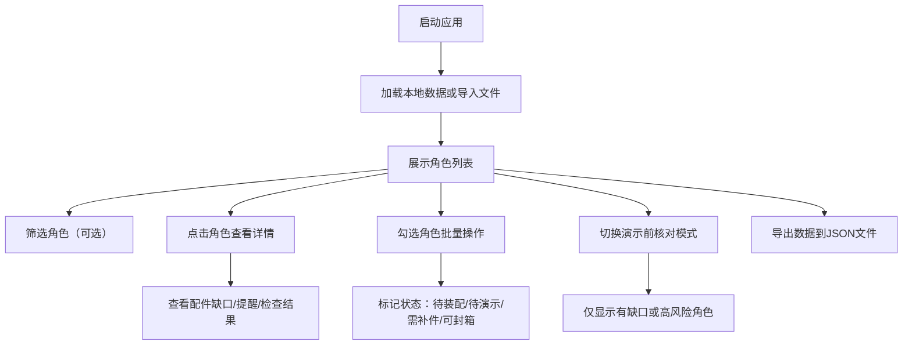

## 1. 产品概述

皮影角色管理系统是一款面向皮影戏表演团队的客户端工具，用于系统化管理皮影角色片、连杆、幕布配件及演示顺序。通过可视化界面和自动化检查，帮助团队高效完成角色配置、状态跟踪、风险预警及演示前核对工作。

- **目标用户**：皮影戏表演团队的道具管理人员、表演编排人员
- **核心价值**：减少人工核对疏漏，提高装配效率，降低演出风险

## 2. 核心功能

### 2.1 用户角色

| 角色 | 注册方式 | 核心权限 |
|------|----------|----------|
| 管理员/操作员 | 本地使用，无需注册 | 所有功能操作权限 |

### 2.2 功能模块

1. **数据管理模块**：角色新增、编辑、删除、复制配置、文件导入导出
2. **筛选查询模块**：多条件组合筛选（故事、责任人、状态、风险等级、顺序区间）
3. **批量操作模块**：批量标记"待装配""待演示""需补件""可封箱"
4. **详情展示模块**：配件缺口列表、操作提醒、完整角色信息
5. **自动检查模块**：演示顺序重复、连杆数量异常、高风险角色过多、责任人为空、补件备注缺失
6. **演示核对模块**：演示前核对模式，仅显示有问题的角色

### 2.3 页面详情

| 页面名称 | 模块名称 | 功能描述 |
|-----------|-------------|---------------------|
| 主管理页 | 顶部工具栏 | 导入/导出数据、切换演示前核对模式、新增角色、批量操作按钮 |
| 主管理页 | 筛选区 | 故事下拉、责任人下拉、状态多选、风险等级、顺序区间输入 |
| 主管理页 | 角色列表 | 表格展示角色信息、复选框多选、行点击查看详情、操作列（编辑/复制/删除） |
| 主管理页 | 详情面板 | 展示选中角色的完整信息、配件缺口清单、操作提醒、自动检查结果 |
| 主管理页 | 新增/编辑弹窗 | 角色信息录入表单，含验证提示 |

## 3. 核心流程

主要用户操作流程：

1. 用户进入系统，可导入已有数据或从零开始录入
2. 通过筛选区快速定位目标角色，或直接浏览列表
3. 点击角色行查看详情（配件缺口、操作提醒、检查结果）
4. 勾选多个角色进行批量状态标记
5. 系统自动检查并实时提示异常项
6. 切换至"演示前核对"模式，聚焦仍有问题的角色
7. 导出数据进行备份或团队共享

## 4. 用户界面设计

### 4.1 设计风格

- **主色调**：皮影戏文化色——朱砂红 (#B91C1C) 为主色，搭配宣纸米白 (#FEF3C7)、墨黑 (#1F2937)
- **辅助色**：金黄 (#D97706) 用于高亮警示，竹青 (#059669) 用于正常状态
- **按钮风格**：圆角矩形，带细微阴影，悬停时有轻微上浮效果
- **字体**：标题用衬线体（宋体/Noto Serif SC），正文用现代无衬线体，体现传统与现代融合
- **布局风格**：顶部固定工具栏 + 左侧筛选/列表 + 右侧详情面板的三栏布局
- **视觉元素**：融入皮影剪影装饰纹理、卷轴式卡片边框

### 4.2 页面设计概览

| 页面名称 | 模块名称 | UI元素 |
|-----------|-------------|----------|
| 主管理页 | 顶部工具栏 | 深红色导航栏、品牌标识、功能按钮组（导入/导出/核对模式/新增）、操作状态徽章 |
| 主管理页 | 筛选区 | 卡片式容器、标签化筛选条件、组合下拉、区间输入框、重置按钮 |
| 主管理页 | 角色列表 | 带皮影边框纹理的表格、斑马行、状态彩色标签、风险等级图标、复选框列、行悬停高亮 |
| 主管理页 | 详情面板 | 卷轴式卡片布局、角色名大标题、分节展示（基本信息/配件/提醒/检查）、缺口红色高亮 |
| 主管理页 | 新增/编辑弹窗 | 居中模态框、分组表单、实时校验提示、保存/取消按钮 |

### 4.3 响应式

采用桌面端优先设计，列表与详情左右分栏（≥1280px）；中等屏幕（≥768px）列表详情上下分栏；小屏幕下详情面板改为抽屉式弹出，筛选区可折叠。

### 4.4 动效

- 页面加载时元素渐入，依次延迟出现
- 表格行悬停时背景色渐变过渡
- 状态标签切换时有颜色过渡动画
- 详情面板展开/收起有平滑过渡
- 批量操作完成后显示成功toast提示
